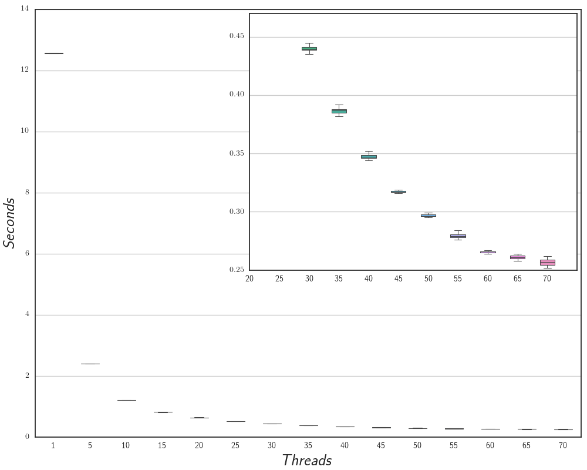
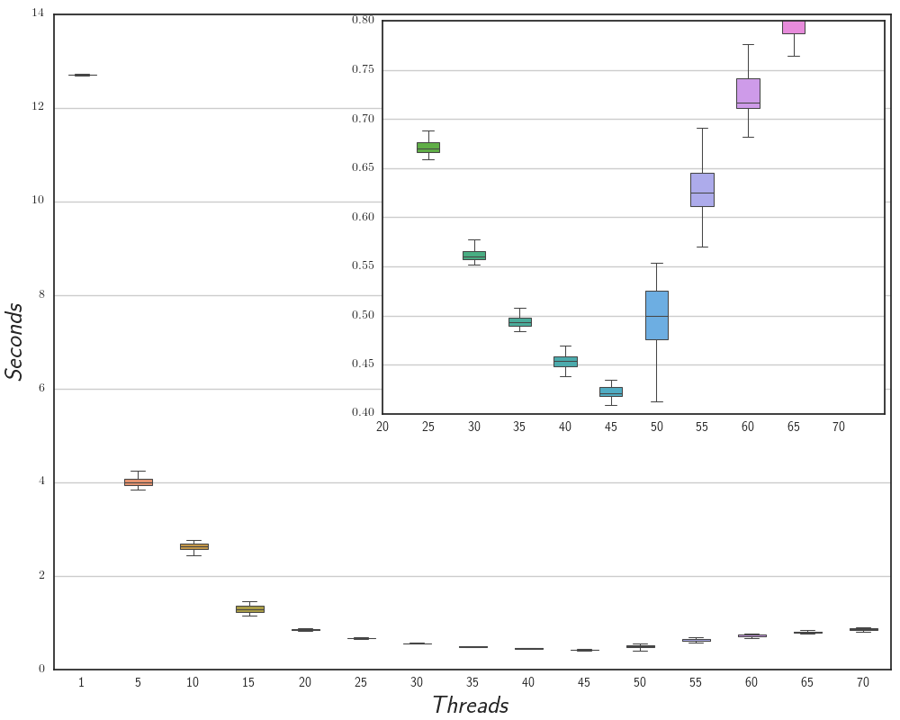
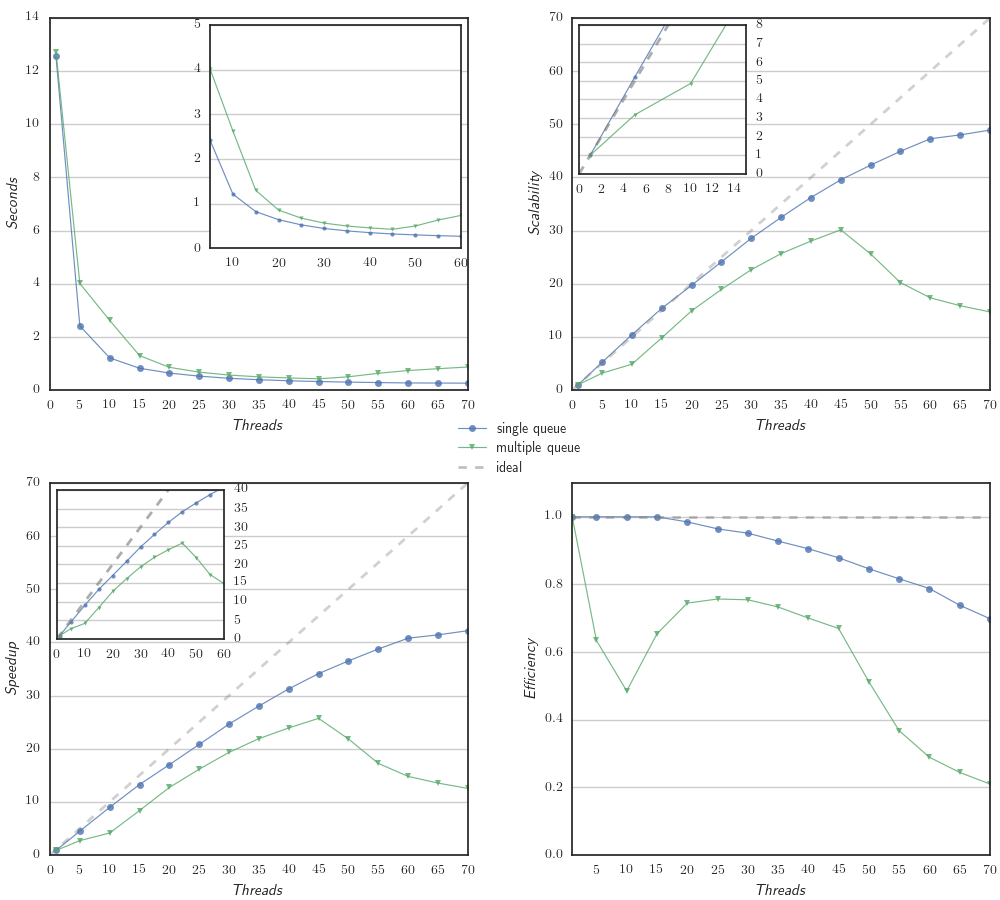
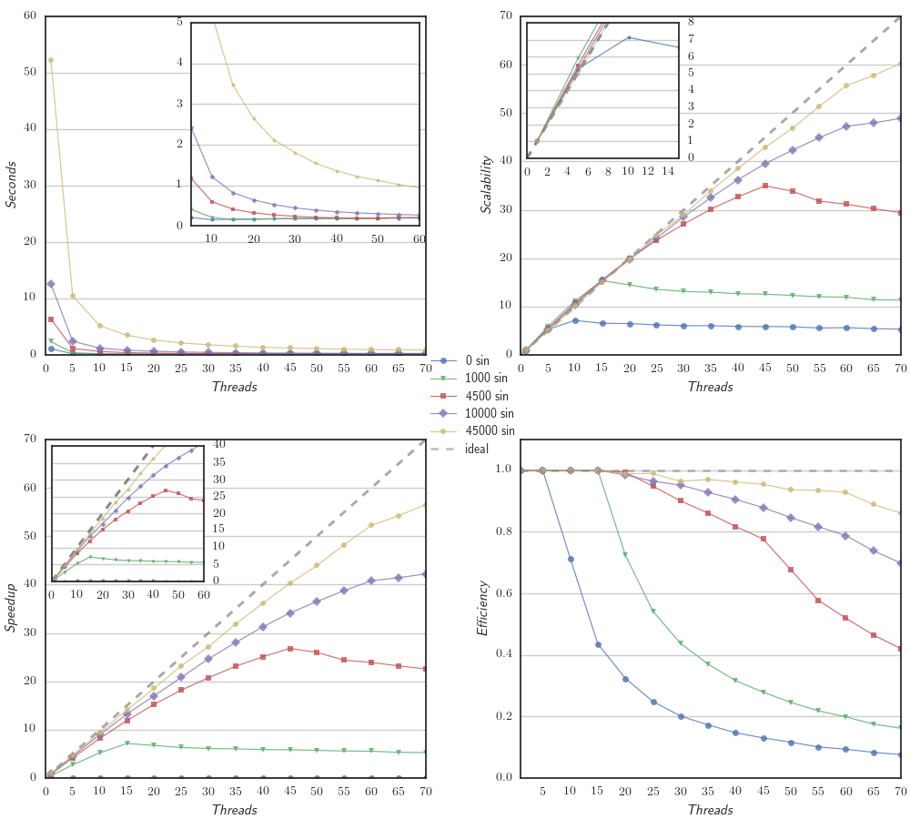

# SPM Project: Micro Macro Data Flow

## Introduction
The project is a c++ micro-MDF library that can execute Macro Data Flow graph with a defined number of threads.

## User Guide
### Requirements:
- g++ >= 4.8 with c++11 support
- cmake >= 3.3

### Compile the tests:
Remember to set the g++ compiler you want to use with cmake in the environment variable CXX (g++ or icc). Than inside the project folder do the following commands:

- `mkdir build`
- `cmake ..`
- `make all`

After the make in the build Folder can be found two type of test file (if as compiler was selected the Intel one also the Intel Xeon PHI version are created):

- `example`, a simple example of the library using the single thread queue
- `example_multy`, the same example but with the multo queue
- `example_no_print`, `example_multy_no_print`, as before but without prints
- `busy_test`, the test employ in for the performance analysis, with the single task  queue
- `busy_test_multy`, the same test but with the multiple task queue
- `busy_test_no_print`, `busy_test_multy_no_print`, the two version without the prints
- `busy_test_sequential`, `busy_test_sequential_no_print`, the two sequential version of the test used in the speed-up evaluation.

The two type of executable can be launch with the following parameter:

- `example_multy <number of threads> <stream lenght>`
- `busy_test_multy <number of threads> <stream lenght> <number of sin itreration>`

if noting is pass the programs start with the maximum number of contest present in the architecture and with a stream of 1000 and for the busy_test are select 10000 sin iteration.

To run the test on the Intel Xeon PHI there are same perl script that generate as result a json used to plot the graph that are show in next session, thous are same working example of the usage:

- `perl script_N.pl busy_test_multy_mic 2000 30 mic0`
- `perl script.pl example_test_multy_mic 5000`

## Experiments
The library was tested on a Intel Xeon Phi by a stream of 2000 integer tokens though the graph show in figure \ref{graph}, where the function F is sequence of sin computation, and the number of iteration are changed to find differers performances.

In the Scalability plot is clear that when the work of a single instruction of the MDF graph increase the plot scale more. This is because we have to pay the cost of the overall structure and so if the cost to find the fireable instruction and start it, is much more than the instruction itself all the system does not worth. We can notice that performance start to be good at 10000 sin iteration that the Intel Xeon Phi execute in roughly $2\ seconds$.
