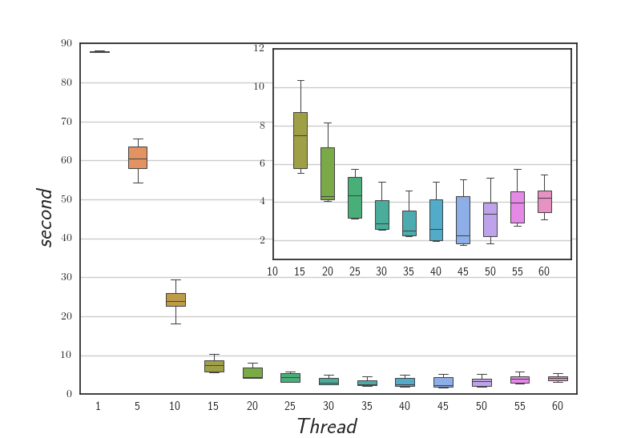
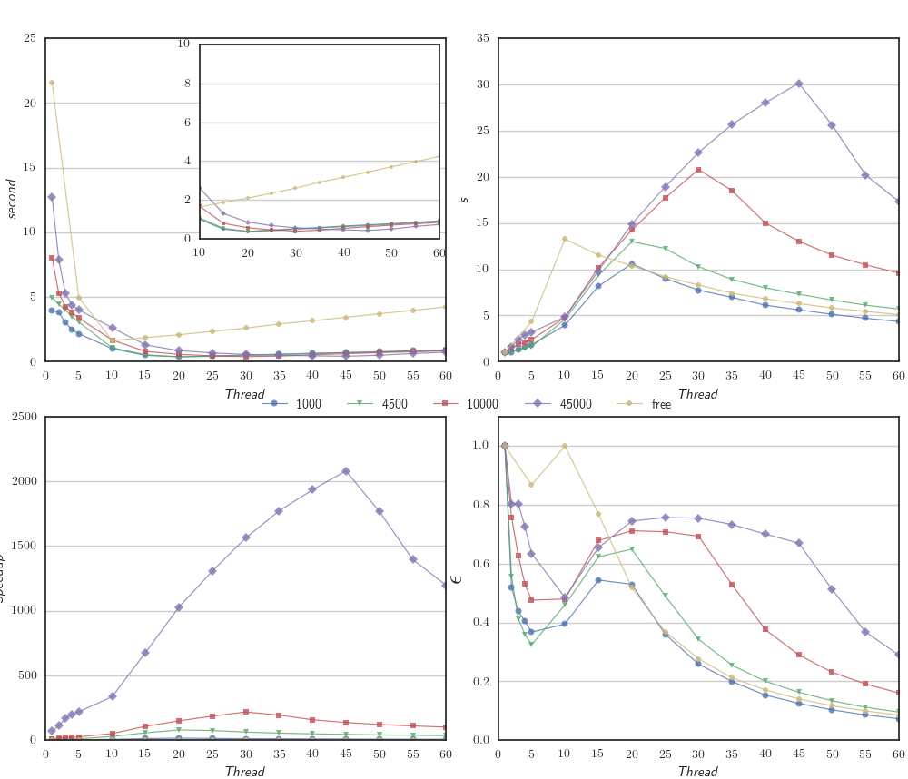

% SPM Project: Micro Macro Data Flow
% Luca Rinaldi
% 12 January 2016

# Introduction
The project is a micro-MDF library to execute MDF graph with a defined number of threads.

# Main Structure
The project is constituted of three principal parts:

- `Graph Repository`, where the MDF graph are stored
- `InterpreterFactory`, able to start and management the evaluation of the MDF graphs
- `ThreadPool`, the actual core of the parallel computation, which manage the task on a fixed number of threads

## Graph Repository
The MDF graphs are organized inside the GraphRepository class inside an `unordered_map` by a name and added by the method `add(string name, shared_ptr<Graph> g)`. The repository is access by the library in read only and it doent include any runtime structure. The graph class have an id and all the data structure to manage a MDF graph such as:

- `std::vector<Statement> _ist`, vector of instruction
- `std::unordered_map<int, std::vector<int>> _token_to_ist`, used to map a token to the instruction that use it as input

The Statement class represent a MDF instruction and define a set of new type:

- t_in, aka. `std::vector<std::shared_ptr<Token>>`, represent a vector of input token
- t_out, aka. `std::shared_ptr<Token>`, it is an output token
- t_type_in, aka. `std::unordered_set<int>`, a set of input token type
- t_type_out, aka. `int`, an ouput type
- fun, aka. `std::function<t_out(t_in)>`, which is the function to be executed

More in detail in the statement struct the following member are present:

- fun f, which is the function to be executed
- t_type_in in, the input type token required to the statement
- t_type_out out, the output type of the function

## Interpreter
The Interpreter part is composed of two part the InterpreterFactory class and the Interpreter class, the former is an the entry point to start the evaluating a new instance of the graph, the latter is the core of the the interpreter and is transparent from the user.

The InterpertFactory manage also the ThreadPool and it can be instanceted by specifing a GraphReposiory and optionally also the number of thread to use to evaluate the graphs. Its possible to start the evaluation of a new graph by the methods `start(string name, initializer_list<shared_ptr<Token>>&& , Drainer)`

In the Interpreter class represent an instance of a graph and for this reason it have a pointer to a graph of the repository and the following structure to evaluate it:

- `std::unordered_map<int, std::shared_ptr<Token>> _token`, an hash map the for each type of token store a pointer to it

- `std::vector<int> _count_ist`, this vector for each instruction in the graph maintain a counter of how many token the instruction need before can be fire.

When the Interpret is instanced for the first time with a graph and a list of initial token, the two data structure, `_token` and `_count_ist`, are intialized with the data.

The algorith to evaluate the graph when start for the first time scan the `_count_ist` to find a fireable instruction, the one with the count at zero. Then the instruction is fired adding a new task to the thread pool.

After this first time the graph continued to evaluated without ulteriorlly scan the data structure.

After a new instruction ended, by the `_token_to_ist` instructor of the graph can be retrieved all the instruction that wait for that token and for all of them the token count is decremented and if one have the counter at zero it is fired using in the same way as before using a new task. It is possible that the token type returned by the instruction is not find inside the `_token_to_ist`, and in this case it mean that no instruction in the graph have that kind of token type as input and than the drainer is called.

In this way the evaluation of the graph is done step by step without further scan of the graph. Also the distinction between the Graph and the interpreter with the runtime structure can reduce duplication space to report the actual structure of the graph.

## ThreadPool\label{tp}
The ThreadPool is structured with a single queue of task where each thread with the use of a mutex take a new task each time end one. This is a good solution for the load balance but can give low performance if the task are small, in this case the overhead of the synchronization can be very hight.
Usually in a MDF the task can be very different in size but not very small, as they are a macro instraction in this situation the single queue it is consider a good solution.

# User Guide

# Experiments
The library was tested by a stream of 2000 integer tokens though the graph show in figure \ref{graph}, where the function F is a composed by sequence of sin computation.

As explaned in section \ref{tp} thouse test show different result if the number of sin computation are different, this result can be see in the graph \ref{sse}, where for each number of sin computation there a different curves.

In the same graph there is also another test where the F function is empty and the token are only copy from input to the output. In this way is was possible to estimate the cost of the library.

In the graph \ref{tc} show the completion time of the MDF graph test with a stream of 5000 integer token and where the function F is a loop of 10000 sin iteration. The test it was done 30 time and it is possible to see the box plot of where the data are more concentrated. The graph highlight that the completion time gradually decrease up to 45 thread then it start to increase, it is done because the overhead of the synchronization of the single task queue slowdown the execution of the task when the number of thread increase.

In the graph \ref{sse} there is the evaluation from left to right of the completion time, the scalability, the speed-up and the efficiently for 6 different number of sin iteration.

Given $T_p^{(n)}$ as completion time with n thread and $T_s$ the complition time of the sequential version, those are the formulas used to plot the data:

- $scalability = \frac{T_p^{(1)}}{T_p^{(n)}}$

- $speed-up = \frac{T_s}{T_p^{(n)}}$

- $efficiently = \frac{scalability}{n}$

In the Scalability plot (right toip of graph \ref{sse}) is clear that when the work of a single istruction of the MDF graph increase the graph scale more. This is given by the structure of the Threadpool.

In the Speed-up graph we can notice that the sequential version without the MDF library is much more fast, given by the instantiation of all the structure and the runtime algorithm to find the fiareble instruction, so if the maximum parallel decree o the the MDF graph is only two as in the test, it does not perform well.
