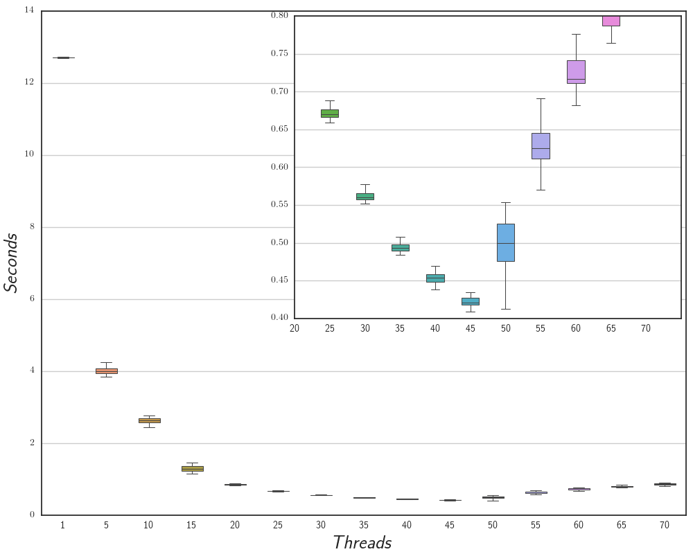
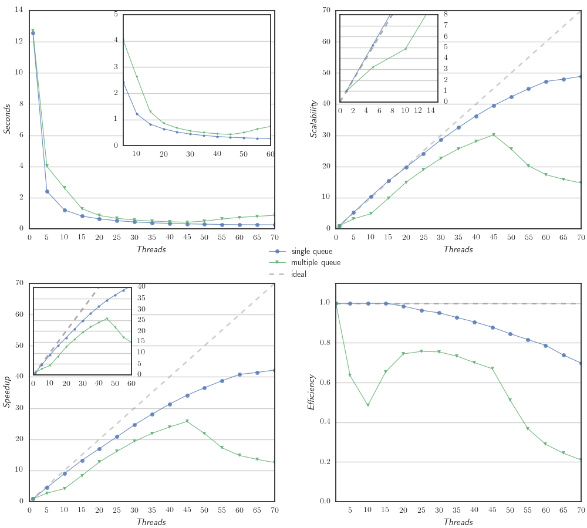

% SPM Project: Micro Macro Data Flow
% Luca Rinaldi
% 22 February 2016

# Introduction
The project is a c++ micro-MDF library that can execute Macro Data Flow graph @danelutto with a defined number of threads.

# Main Structure
The project consist of three principal parts:

- `Graph Repository`, the repository of the MDF graph, that can be executed by the library
- `InterpreterFactory`, able to start and manage the evaluation of a MDF graphs stored in the repository.
- `ThreadPool`, the core of the parallel computation, with two implementations of task queue.

## Graph Repository
The MDF graphs are organized in the `GraphRepository` class with an `std::unordered_map` by names, and they can be added by two overload of the method add:

- `add(string name, shared_ptr<Graph> graph)`
- `add(string name, initializer_list<Statement> list)`

As we will see in section \ref{inter} the graph repository is read only for the other parts of the library and it does not include any runtime structure.

In the `Graph` class there are all the useful structures to locate and find the instruction or the token inside the graph such as:

- `std::vector<Statement> _ist`, vector of instruction
- `std::unordered_map<int, std::vector<int>> _token_to_ist`, used to map a token to all the instructions that use it as input.

The `Statement` struct represent a MDF instruction and define a set of new type:

- t_in, aka. `std::vector<std::shared_ptr<Token>>`, represent a vector of input token
- t_out, aka. `std::shared_ptr<Token>`, it is an output token
- t_type_in, aka. `std::unordered_set<int>`, a set of input token type
- t_type_out, aka. `int`, an output type
- fun, aka. `std::function<t_out(t_in)>`, which is the function to be executed

More in detail in the `Statement` struct the following members are present:

- fun f, which is the function to be executed
- t_type_in in, the input type token required to the statement
- t_type_out out, the output type of the function

## Interpreter\label{inter}
The Interpreter is composed of two parts the `InterpreterFactory` class and the `Interpreter` class. The former is an the entry point to start the evaluation of a new instance of a graph; the latter can be consider as an instance of a graph and so it is directly associated with a graph and is totally transparent to the user.

The `InterpertFactory` also manages the `ThreadPool` and it can be instantiated by specifying a GraphReposiory and optionally the number of threads to use to evaluate the graphs.

After the instantiation it is possible to start the evaluation of a graph calling the method `start(string name, initializer_list<shared_ptr<Token>>&& , Drainer)`, with the name of the graph, the initial input tokens and the Drainer function (alias of `std::function<void(std::shared_ptr<Token>)>`).

The `Interpreter` class implements the algorithm to find and run the fireable instruction inside an associated graph, and to do it the following data structures are used:

- `std::unordered_map<int, std::shared_ptr<Token>> _token`, hash map that for each type of token store a pointer to it

- `std::vector<int> _count_ist`, here for each instruction stores the number of left token before the instruction became fireable.

### Algorithm to find fireable instruction
When the Interpreter is instantiated for the first time, the `_token` map is initialized with the initial token and the vector `_count_ist` with the number token needed by each instruction.

Now the evaluation of the graph starts using the `_token_to_ist` map of the graph to find which instruction has as input token the one given at the beginning. For each of them the `_cout_ist` of that instruction is decremented till a fireable one is founded.

Then the token are retrieved from the map `_token` and the function with the input token is added to the `ThreadPool` as a new task.

Then after each execution of the instruction, thanks to the `_token_to_ist` structure, the other fireable instruction can be easily found as before.

When the output token of an instruction is not found in the `_token_to_ist`, that means that no instruction in the graph have that type of token as input and than the drainer is to be called.

In this way the evaluation of the graph is done step by step without further scan of the graph. Also the distinction between the Graph and the Interpreter reduce the duplication of the space due to the size of the graph structure.

## ThreadPool\label{tp}
In the Library there are two types of ThreadPool one that implements a single queue of task and the other with a queue for each thread, but without any job steling policy.

Each of them includes the same interface with two public methods:

- `void addTask(function<void()> &&)`, this function adds a new task given as an anonymous void function
- `void wait()`, when called it tells the ThreadPool that the stream is ended and so when the thread finds a queue empty it can quit.

The two type of task queue can be selected by giving as parameter of the `InterpreterFactory` the enum `QueueType (SINGLE or MULTY)`, if nothing is specifyed the Single queue system is selected.

The single queue can be better when the tasks have very different completion time, because it always balances the execution, but it can show a lot of overhead due to the synchronization for accessing the single queue, specially with a big amount of threads.

On the other hand the multiple queue without job stealing can have some problems of load balances but it has less overhead for the synchronization, because each thread can get a new task without additional synchronization with the other one.

In the multi queue system when a new task is added the thread pool search for the queue with less task inside and push to it the task.

# User Guide
## Requirements:
- g++ >= 4.8 with c++11 support
- cmake >= 3.3

## Compile the tests:
Remember to set the g++ compiler you want to use with cmake in the environment variable CXX (g++ or icc). Than inside the project folder do the following commands:

- `mkdir build`
- `cmake ..`
- `make all`

After the make in the build Folder can be found two type of test file (if as compiler was selected the Intel one also the Intel Xeon PHI version are created):

- `example`, a simple example of the library using the single thread queue
- `example_multy`, the same example but with the multo queue
- `example_no_print`, `example_multy_no_print`, as before but without prints
- `busy_test`, the test employ in for the performance analysis, with the single task  queue
- `busy_test_multy`, the same test but with the multiple task queue
- `busy_test_no_print`, `busy_test_multy_no_print`, the two version without the prints
- `busy_test_sequential`, `busy_test_sequential_no_print`, the two sequential version of the test used in the speed-up evaluation.

The two type of executable can be launch with the following parameter:

- `example_multy <number of threads> <stream lenght>`
- `busy_test_multy <number of threads> <stream lenght> <number of sin itreration>`

if noting is pass the programs start with the maximum number of contest present in the architecture and with a stream of 1000 and for the busy_test are select 10000 sin iteration (see \ref{exp}).

To run the test on the Intel Xeon PHI there are same perl script that generate as result a json used to plot the graph that are show in section \ref{exp}, thous are same working example of the usage:

- `perl script_N.pl busy_test_multy_mic 2000 30 mic0`
- `perl script.pl example_test_multy_mic 5000`

# Experiments\label{exp}
The library was tested on a Intel Xeon Phi by a stream of 2000 integer tokens though the graph show in figure \ref{graph}, where the function F is sequence of sin computation, and the number of iteration are changed to find differers performances.

For each different test executed on the library are evaluated same performance index to estimate the behavior @vanneschi2014high. Given $T_p^{(n)}$ as completion time with n thread and $T_s$ as the completion time of the sequential version, we can define:

- $scalability = \frac{T_p^{(1)}}{T_p^{(n)}}$

- $speedup = \frac{T_s}{T_p^{(n)}}$

- $efficiency = \frac{scalability}{n}$

In the plot \ref{tc_s} and \ref{tc_m} there is the completion time of the two version of the queue system explained in section \ref{tp}. The two tests are done with a stream of 2000 integer token and where the function F is a loop of 10000 sin iteration. The test was done 30 times and it is possible to see the box plot of where the data are more concentrated. The plot \ref{tc_s} highlights that the completion time gradually decreases up to 45, and then it starts to increase due to the overhead of the synchronization of the single task queue slowdown the execution of the task when the number of thread increase.

This behaviour is not present in plot \ref{tc_m} where we can see that the multi queue system. It is much better, we have also to consider that in this test the computation for each task is the same, so there is not situation where the thread does not have task to compute.

The comparison of this two type of scheduling of the task is also visible in the plot \ref{vs} where there are also the computation of the scalability, speed-up and efficiency.

In the plot \ref{sse} there is show the completion time, the scalability, the speed-up and the efficiently for 0, 1000, 4500, 10000, 45000 sin iteration, of the version with multiple task queue.

In the Scalability plot (right top of figure \ref{sse}) is clear that when the work of a single instruction of the MDF graph increase the plot scale more. This is because we have to pay the cost of the overall structure and so if the cost to find the fireable instruction and start it, is much more than the instruction itself all the system does not worth. We can notice that performance start to be good at 10000 sin iteration that the Intel Xeon Phi execute in roughly $2\ seconds$.

In the Speed-up plot (right bottom of figure \ref{sse}) we can notice that the sequential version without the MDF library is faster, given by the instantiation of all the structure and the runtime algorithm to search and fire new instruction, and so all the test are under the ideal curve

# Conclusion
In this project we have seen a simple implementation of micro Macro Data Flow library, with in the over all good performance. In future can be shown some better performance of the single task queue against the multi queue if the instructions of the data flow graph have really different calculation time.
