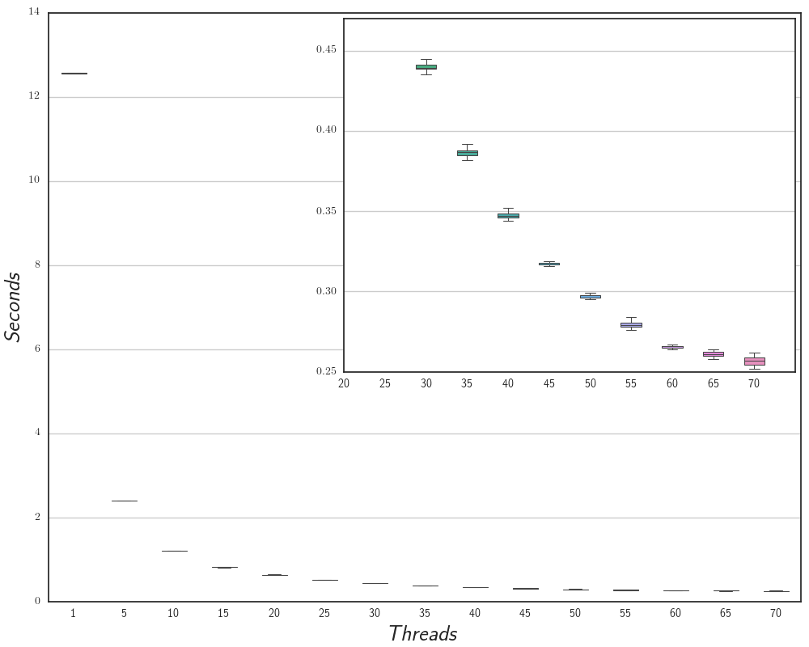

% SPM Project: Micro Macro Data Flow
% Luca Rinaldi
% 22 February 2016

# Introduction
The project is a micro-MDF library that can execute MDF graph with a defined number of threads.

# Main Structure
The project is constituted of three principal parts:

- `Graph Repository`, the repository of the MDF graph, that can be executed by the library
- `InterpreterFactory`, able to start and management the evaluation of a MDF graphs stored in the repository.
- `ThreadPool`, the core of the parallel computation, with two type of shedule single queue or multiple queue of task.

## Graph Repository
The MDF graphs are organized in the GraphRepository class with an `unordered_map` by a name. a new graphs can be added by two overload of the method add:

- `add(string name, shared_ptr<Graph> graph)`
- `add(string name, initializer_list<Statement> list)`

The repository is access by the library in read only and it does not include any runtime structure, which are in the Interpreter class (section\ref{inter}).

In the `Graph` class there are all useful structure to locate and find the instruction or the token inside the graph such as:

- `std::vector<Statement> _ist`, vector of instruction
- `std::unordered_map<int, std::vector<int>> _token_to_ist`, used to map a token to the instructions that use it as input

The `Statement` struct represent a MDF instruction and define a set of new type:

- t_in, aka. `std::vector<std::shared_ptr<Token>>`, represent a vector of input token
- t_out, aka. `std::shared_ptr<Token>`, it is an output token
- t_type_in, aka. `std::unordered_set<int>`, a set of input token type
- t_type_out, aka. `int`, an output type
- fun, aka. `std::function<t_out(t_in)>`, which is the function to be executed

More in detail in the statement struct the following member are present:

- fun f, which is the function to be executed
- t_type_in in, the input type token required to the statement
- t_type_out out, the output type of the function

## Interpreter\label{inter}
The Interpreter part is composed of two part the `InterpreterFactory` class and the `Interpreter` class, the former is an the entry point to start the evaluating of a new instance of a graph, the latter can be consider as an instance of a graph and so it is directly associated with a graph and is totally transparent for the user.

The `InterpertFactory` also manages the ThreadPool and it can be instanced by specifying a GraphReposiory and optionally the number of thread to use to evaluate the graphs.

After the instantiation it is possible to start the evaluation of a new graph by the methods `start(string name, initializer_list<shared_ptr<Token>>&& , Drainer)`, where specifying the name of the graph the input token and the Drainer function which the following type `std::function<void(std::shared_ptr<Token>)>`.

In `Interpreter` class implement the algorithm to find and run the fireable instruction inside an associated graph, and to do it the following data structure are used:

- `std::unordered_map<int, std::shared_ptr<Token>> _token`, an hash map the for each type of token store a pointer to it

- `std::vector<int> _count_ist`, this vector for each instruction in the graph maintain a counter of how many token the instruction need before became fire.

When the Interpret is instanced for the first time the `_token` map is initialized with the initial token and the vector `_count_ist` with in each position the number of input token needed for each instruction. Now the evaluation of the graph start using the `_token_to_ist` map of the graph to find which instruction has as input token the one given at the beginning. For each of them the `_cout_ist` of that instruction is decremented till a fireble one is founded.

Then the token are retrieve from the map `_token` and the function with the input token are to the `ThreadPool` as a new task.

Then after each execution of the instruction thanks for the `_token_to_ist` structure as before the other fireble instruction are founded.

When the output token of an instruction is not found in the `_token_to_ist` than it means that no instruction in the graph have that type of token as an input and than the drainer is called.

In this way the evaluation of the graph is done step by step without further scan of the graph. Also the distinction between the Graph and the interpreter with his runtime structure can reduce duplication space due to the size of the graph structure.

## ThreadPool\label{tp}
In the Library there are two type of ThreadPool one that inplement a single queue of task and onothjer with a queue of each thread, but without any job steeling policy.
The two type of task sheduling can be selected by give as paramente of the `InterpreterFactory` the enum QueueType(SINGLE or MULTY), if notthing is specifying the Single queue system is selected.

The single queue can be better when the the task have diferent coimplition time, brause it is always balance the exevution, but it can have alot of overhead due to the synchronization for the access of the queue.

On the other hand the multiple queue without job stealing can have some problem of load balances but it have less overhead for the synchronization, because each thread can get a new task without additional synchronization with the other threads.

In the multi queue system when a new task is added the thread pool search for the queue with less task inside and push to it the task. The count

# User Guide
## Requirements:
- g++ >= 4.8 with c++11 support
- cmake >= 3.3

## Compile the tests:
Remember to set the g++ compiler you want to use with cmake in the enviromenet varible CXX (g++ or icc).
Than inside the project folder do the following commands:
- `mkdir build`
- `cmake ..`
- `make all`

After the make the two type of executible are generated:
- `example`, a simple example of the library using the single thread queue
- `example_multy`, the same example but with the multy queue
- `example_no_print`, `example_multy_no_print`, as before but without prints
- `busy_test`, the test employ in for the performance analysis, with the single task  queue
- `busy_test_multy`, the same test but with the multiple task queue
- `busy_test_no_print`, `busy_test_multy_no_print`, the two version without the prints
- `busy_test_sequential`, `busy_test_sequential_no_print`, the two sequential version of the test used in the speed-up evaluetion.

If the compilation is done with icc also the mic version of the file are generated.

The two type of executable can be launch with the following parameter:
- `example_multy <number of threads> <stream lenght>`
- `busy_test_multy <number of threads> <stream lenght> <number of sin itreration>`
if noting is pass the programs start with the maximum number of contest present in the architecture

To run the test on the MIC there same perl script, thouse are working command, that can be used:
`perl script_N.pl busy_test_multy_mic 2000 30 mic0`
`perl script.pl example_test_multy_mic 5000`

# Experiments
The library was tested by a stream of 2000 integer tokens though the graph show in figure \ref{graph}, where the function F is sequence of sin computation.

As explained in section \ref{tp} if the computation of the each node of the graph is very small the performance decreases very thouse test show different result if the number of sin computation are different, this result can be see in the plot \ref{sse}, where for each number of sin computation there a different curves.

For each diffent test executed on the library are evalueted same performance index to estimate the behavior as following.
Given $T_p^{(n)}$ as completion time with n thread and $T_s$ as the completion time of the sequential version, we can define:

- $scalability = \frac{T_p^{(1)}}{T_p^{(n)}}$

- $speed-up = \frac{T_s}{T_p^{(n)}}$

- $efficiently = \frac{scalability}{n}$

In the plot \ref{tc_s} and \ref{tc_m} there is the completion time of the two version of the queue system explained in section \ref{tp}. The two test are done with a stream of 2000 integer token and where the function F is a loop of 10000 sin iteration. The test it was done 30 time and it is possible to see the box plot of where the data are more concentrated. The plots \ref{tc_s} highlight that the completion time gradually decrease up to 45, and then it start to increase, it is done because the overhead of the synchronization of the single task queue slowdown the execution of the task when the number of thread increase.

This behavior is not present in plot \ref{tc_m} where we can see that the multi queue system is much better, we have also to consider that in this test the computation for each task is the same, so there is not situation where the thread does not have task to compute.

The comparison of this two type of scheduling of the task is also visible in the plot \ref{vs} where there are also the computation of the scalability, speed-up and efficiency.

In the plot \ref{sse} there is show the completion time, the scalability, the speed-up and the efficiently for 0, 1000, 4500, 10000, 45000 sin iteration, of the version with multiple task queue.

In the Scalability plot (right top of figure \ref{sse}) is clear that when the work of a single istruction of the MDF graph increase the plot scale more.

In the Speed-up graph we can notice that the sequential version without the MDF library is faster, given by the instantiation of all the structure and the runtime algorithm to search and fire new instruction.
